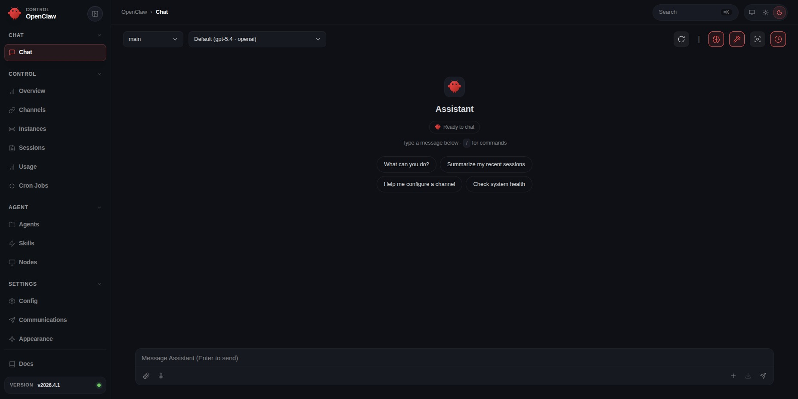

# OpenClaw — Minimal Docker Compose

> Deploy one or more [OpenClaw](https://openclaw.ai) instances on a single server with a single command.

---

## I. Quick Installation

Install [Docker](https://docs.docker.com/get-docker/) and [Docker Compose](https://docs.docker.com/compose/install/), then run:

```bash
curl -fsSL https://raw.githubusercontent.com/minhng92/openclaw-minimal-docker-compose/master/run.sh | bash -s -- --destination openclaw-one
```

This creates an OpenClaw instance at **`http://localhost:18789`** with the default gateway password `minhng.info`.

To spin up a **second instance** on different ports:

```bash
curl -fsSL https://raw.githubusercontent.com/minhng92/openclaw-minimal-docker-compose/master/run.sh | bash -s -- --destination openclaw-two --port 18889 --port-ws 18890
```

### Arguments

| Flag | Description | Default |
|---|---|---|
| `--destination` | Installation directory | *(required)* |
| `--port` | Gateway HTTP port | `18789` |
| `--port-ws` | Gateway WebSocket port | `18790` |
| `--password` | Gateway login password | `minhng.info` |
| `--model-provider` | Model provider name | `openai` |
| `--model-base-url` | Model provider base URL | `https://api.openai.com` |
| `--model-api-key` | Model provider API key (written to `agent.env`) | — |
| `--model-api-adapter` | Model API adapter | `openai-completions` |
| `--model-id` | Model ID | `gpt-5.4` |
| `--telegram-bot-token` | Telegram bot token (written to `agent.env`) | — |

### Examples

**Custom gateway password:**

```bash
curl -fsSL https://raw.githubusercontent.com/minhng92/openclaw-minimal-docker-compose/master/run.sh | bash -s -- --destination openclaw-one --password mySecret123
```

**Password + model API key:**

```bash
curl -fsSL https://raw.githubusercontent.com/minhng92/openclaw-minimal-docker-compose/master/run.sh | bash -s -- --destination openclaw-one --password mySecret123 --model-api-key sk-proj-abc123XYZ
```

**Custom model provider (e.g. Anthropic):**

```bash
curl -fsSL https://raw.githubusercontent.com/minhng92/openclaw-minimal-docker-compose/master/run.sh | bash -s -- \
  --destination openclaw-one \
  --model-provider deepseek \
  --model-base-url https://api.deepseek.com \
  --model-api-key sk-abc123XYZ \
  --model-api-adapter openai-completions \
  --model-id deepseek-chat
```

**All options (custom ports + password + model + Telegram):**

```bash
curl -fsSL https://raw.githubusercontent.com/minhng92/openclaw-minimal-docker-compose/master/run.sh | bash -s -- \
  --destination openclaw-one \
  --port 18789 \
  --port-ws 18790 \
  --password mySecret123 \
  --model-api-key sk-proj-abc123XYZ \
  --telegram-bot-token XXX:XXX
```

> **Note:** If `curl` is not installed, run `sudo apt-get install curl` (Debian/Ubuntu) or `sudo yum install curl` (RHEL/CentOS).

---

## II. Manual Installation

```bash
git clone git@github.com:minhng92/openclaw-minimal-docker-compose.git
cd openclaw-minimal-docker-compose
# touch agent.env
# nano agent.env   # set OPENCLAW_GATEWAY_PASSWORD, model provider, Telegram token, etc.
docker-compose up -d
```

### Configuration files

| File | Purpose |
|---|---|
| `.env` | Default environment variables (tracked by Git) |
| `agent.env` | **Deployment overrides** — takes precedence over `.env`, ignored by `.gitignore` |
| `openclaw.json` | OpenClaw gateway & agent configuration ([reference](https://docs.openclaw.ai/gateway/configuration-reference)) |

To change the **gateway password** for a manual install, set the variable in `agent.env`:

```bash
OPENCLAW_GATEWAY_PASSWORD=mySecret123
```

To expose the gateway on **custom ports**, edit the host-side values (before the colon) in `docker-compose.yml`:

```yml
    ports:
      - "YOUR_HTTP_PORT:18789"
      - "YOUR_WS_PORT:18790"
```

---

## III. Device Pairing (First Connection)

Open `http://localhost:18789` and log in with your gateway password (default: `minhng.info`).
On the first connection the UI will show **_pairing required_**.

Approve the pending device request from the terminal
(see also: [OpenClaw docs — Device Pairing](https://docs.openclaw.ai/web/control-ui#device-pairing-first-connection)):

```bash
docker-compose exec openclaw-gateway bash -c 'openclaw devices list'
# ...
#Pending (1)
#┌──────────────────────────────────────┬──────────────────────────────────┬──────────┬────────────────────────────────────────────────────┬────────────┬────────┬────────┐
#│ Request                              │ Device                           │ Role     │ Scopes                                             │ IP         │ Age    │ Flags  │
#├──────────────────────────────────────┼──────────────────────────────────┼──────────┼────────────────────────────────────────────────────┼────────────┼────────┼────────┤
#│ 9c4b3ec7-73d1-4f02-9097-636e44e8c611 │ d45c8d9425868ef6561aa005daa28f50 │ operator │ operator.admin, operator.read, operator.write,     │            │ 1m ago │        │
#│                                      │ ce889e9b591b8300bcebcad37cb68f01 │          │ operator.approvals, operator.pairing               │            │        │        │
#└──────────────────────────────────────┴──────────────────────────────────┴──────────┴────────────────────────────────────────────────────┴────────────┴────────┴────────┘
# ...
docker-compose exec openclaw-gateway bash -c 'openclaw devices approve <REQUEST-ID>'
# example:
docker-compose exec openclaw-gateway bash -c 'openclaw devices approve 9c4b3ec7-73d1-4f02-9097-636e44e8c611'
# Approved d45c8d9425868ef6561aa005daa28f50ce889e9b591b8300bcebcad37cb68f01 (9c4b3ec7-73d1-4f02-9097-636e44e8c611)
```

After approval, log in again to access the Control UI:

<p>

</p>

### Telegram Bot Pairing

Requires a Telegram bot token already configured (via `.env` or `agent.env`).

Start a chat with your bot on Telegram. The bot will reply with a **pairing code**.
Then approve it from the terminal:

```bash
docker-compose exec openclaw-gateway bash -c 'openclaw pairing approve telegram <PAIRING-CODE>'
# example:
docker-compose exec openclaw-gateway bash -c 'openclaw pairing approve telegram NFXA5QFG'
# Approved telegram sender XXXXXXXXXX.
```

---

## IV. Grant Full Execution Permission

Edit `_data/exec-approvals.json` and set the following (the file uses [JSON5](https://json5.org/) syntax):

```json
{
  // ...
  "defaults": {
    "security": "full",
    "ask": "off"
  }
  // ...
}
```

---

## V. Managing the Instance

Apply modified env:

```bash
docker-compose down && docker-compose up -d
```

Check logging:

```bash
docker-compose logs --tail 50
```

**Stop** the instance:

```bash
docker-compose down
```

**Restart** the instance:

```bash
docker-compose restart
```

**Remove** an instance completely:

```bash
docker-compose down -v
cd .. && rm -rf <destination-folder>
```

**Backup and Restore** the instance easily:

```bash
# backup
sudo zip -r openclaw-minimal.zip  openclaw-minimal
# restore
sudo unzip openclaw-minimal.zip
cd openclaw-minimal
docker-compose up -d
```

---

## ☕ Buy Me a Coffee

If you find this project helpful, consider buying me a coffee to support my work!

<a href="https://buymeacoffee.com/minhng.info" target="_blank"></a>
